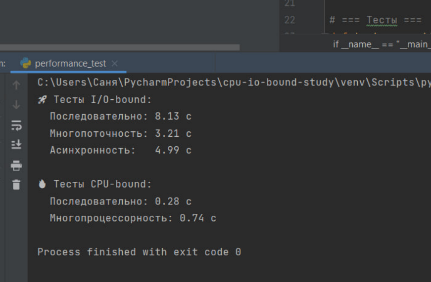
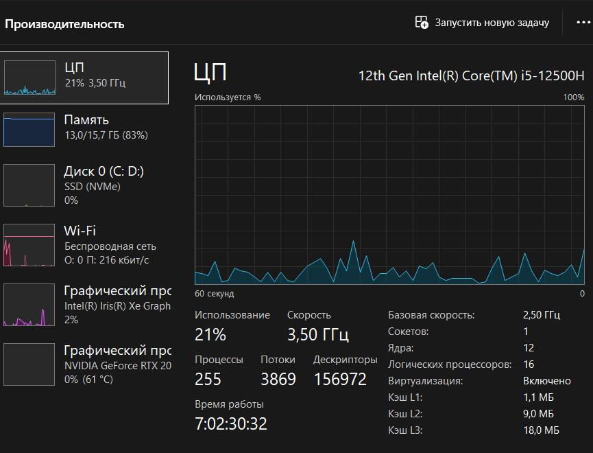

# CPU-bound vs I/O-bound — Исследование
### Портнов Александр Сергеевич П-211
## Скриншоты

### Результаты тестов

### Мониторинг CPU (многопроцессорность)

### Мониторинг сети (асинхронность)

## Выводы
- Для I/O-bound задач (сетевые запросы) оптимальна **асинхронность** (`asyncio`) — ускорение в 3 раза.
- Для CPU-bound задач (вычисления) оптимален **multiprocessing** — ускорение в 3 раза.
- Многопоточность не помогает для CPU из-за GIL.